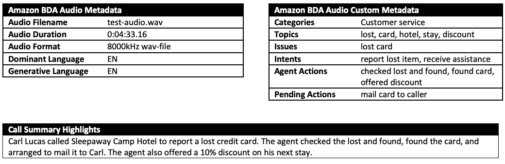
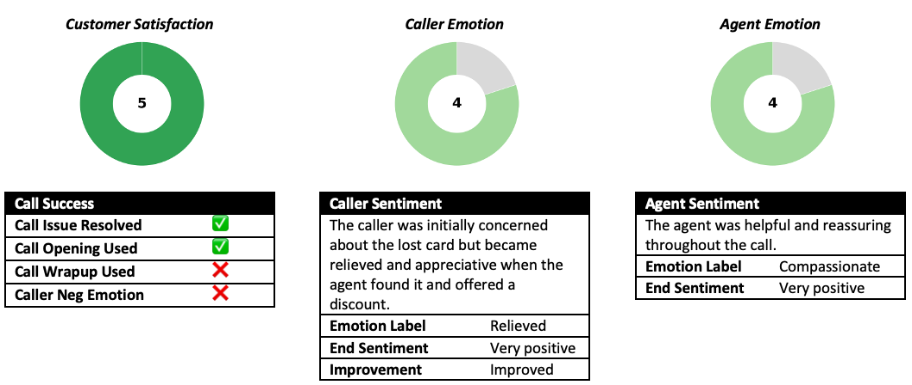
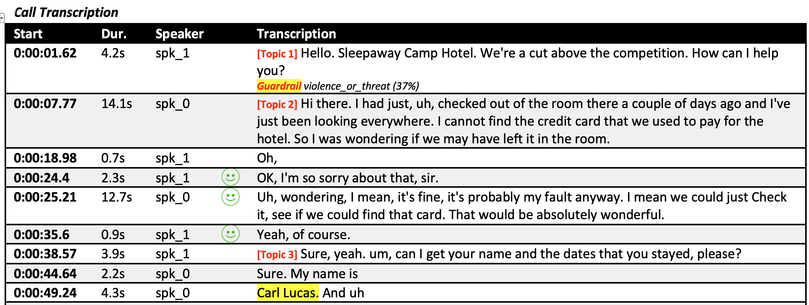
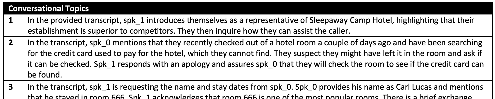
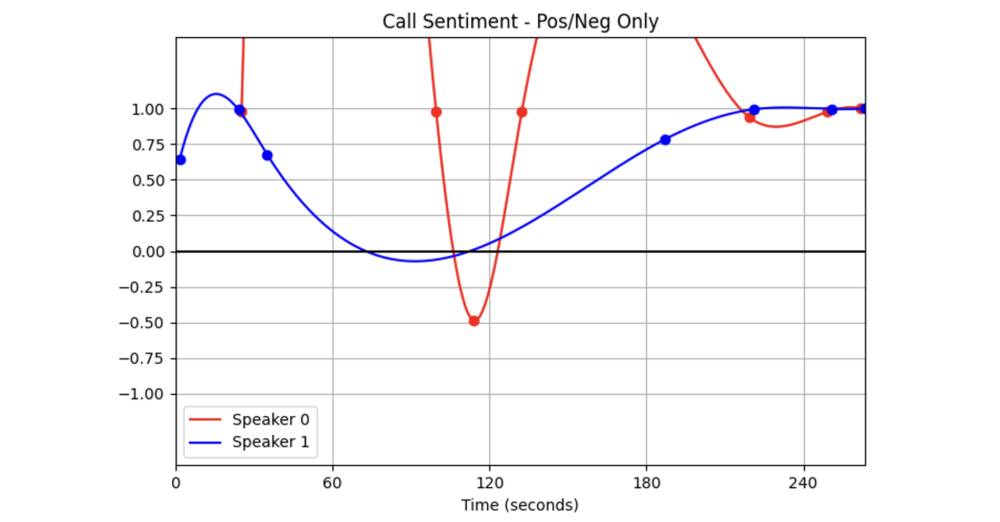

## Amazon Bedrock Data Automation

##### Parameters

The Python3 application has the following usage rules:

```
usage: bda-to-word  --inputFile filename
                   [--outputFile filename] [--guardrailCheck {on|off}]
                   [--guardrailLimit limit]  [--sentiment {on|off}]
                   [--customFile filename]
```

- **Mandatory**
  - `--inputFile` -  path to a standard JSON results file from BDA Audio job that is to be processed
- **Optional**
  - `--outputFile` - the name of the output Word document.  Defaults to the name of the input file/job with a ".docx" extention
  - `--guardrailCheck {on|off}` - optional flag to enable or disable the guardrail checks on the output.  Defaults of off
  - `--guardrailLimit` - floating point optional parameter between 0.00 and 1.00 confidence letel where we trigger the report of a guardrail check.  Defaults on 0.20
  - `--sentiment {on|off}` - enable or disable the generation of sentiment data via Amazon Comprehend.  Defaults to off
  - `--customerFile` - path to the custom blueprint output file to process


#### Word Output Screenshots



The header part of the transcript contains three potential sections.  The *Amazon BDA Audio Metadata* and *Call Summary Highlights* sections are always present, although the content of the summary is different depending on whether or not you are using the custom blueprint - if you use custom then then the cuustom summary field is shown, and if not the standard summary field is show.  The *Amazon BDA Audio Custom Metrics* table is only shown when the custom blueprint is being used, and includes the general information that that blueprint exposes about the call.



The custom blueprint provides additional information on the nature of the success of the call, as well as on the sentiment indicators of the agent and caller.  The dials show a number in the range 1-5 for each metric, and the colour and filled nature of the circular dial will change with the score.  Under each is information on each category; call success, caller sentiment and agent sentiment.  The information provided is verbatium output from the custom blueprint, but note that it is preferred for there to be red cross in the *Caller Neg Emotion* entry, as a green tick would imply that negative emotion had been shown.



In the transcribe we show the obvious things – the speech segment text, the start time for that segment and its duration. We also show the sentiment indicator for that segment if it has been enabled - naturally, as is common in call centre scenarios, line-by-line sentiment is often neutral, which is partly why we do not show a neutral indicator.  Note that the sentiment features are provided by Amazon Comprehend.

We also show two other conversational areas inherent in BDA Audio - topic detection and guardrail triggers.  A conversation can have multiple topics, and the duraction of a topic can be across many conversational turns, so this demo simply indicates the start segment of the detected topic - you may choose to indicate the end as well, but for simplicity's sake we just show the start here.  The guardrail section has a configurable triggering threshold level, and if any of the pre-determined guardrail settings have a confidence level that breaches this specified limit then it is highlighted in the transcript.



The topics identified in the transcript are just markers showing where the trigger text first began, but the full information on how that topic was triggered is shown in the above table.  The underlying JSON results do give the literal text that triggered the topic, but this demo just shows the generative summary.


The custom blueprint will identify any entities that it discovers in the transcript.  This is additionally broken out into locataions and brand names.  The demo will iterate through a sorted list of entities and output then in a seperate table, identifying if any were also tagged as being locations or brands.

If sentiment has been enabled as a CLI option we will display this call sentiment graph.  This shows the sentiment per speaker where the speech segment was not neutral, which implies that there my be far fewer datapoints per speaker than they have speech segments attributed to them.



