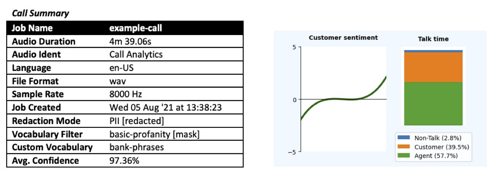
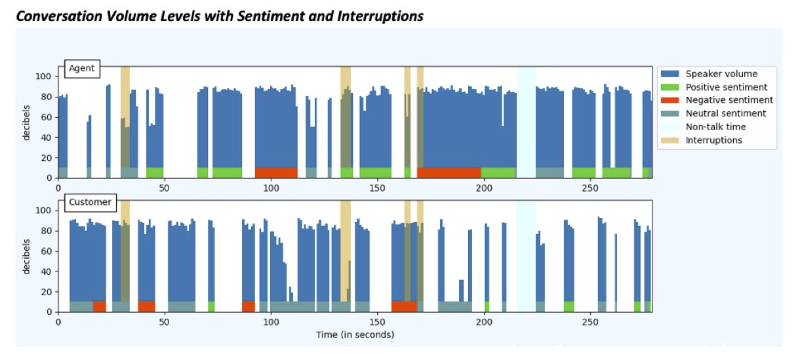
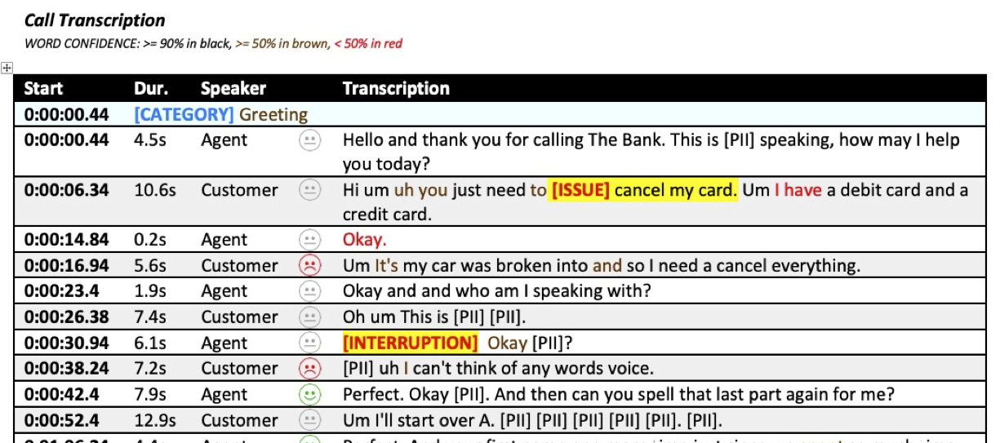

## Amazon Transcribe and Call Analytics

##### Parameters

The Python3 application has the following usage rules:

```
usage: ts-to-word (--inputFile filename | --inputJob job-id)
                  [--outputFile filename] [--sentiment {on|off}]
                  [--confidence {on|off}] [--keep]
```

- **Mandatory** - *(only one of these can be specified)*
  - `--inputFile` - path to a JSON results file from an Amazon Transcribe job that is to be processed
  - `--inputJob` - the JobId of the Amazon Transcribe job that is to be processed
- **Optional**
  - `--outputFile` - the name of the output Word document.  Defaults to the name of the input file/job with a ".docx" extention
  - `--sentiment {on|off}` - if this is a Standard Mode job then this will enable or disable the generation of sentiment data via Amazon Comprehend.  Defaults to off
  - `--confidence {on|off}` - displays a table and graph of confidence scores for all words in the transcript.  Defaults to off
  - `--keep` - retains any downloaded JSON results file


#### Word Output Screenshots



The header part of the transcript contains two sections – the call summary information, which is extracted from Transcribe’s APIs,  and if you have used Call Analytics then this is followed by the caller sentiment trend and talk time split on the call. As you can see, many of the custom options for Transcribe, such as PII redaction, custom vocabulary and vocabulary filters, are called out, so you can always see what options were used.

Note that if you processing a local JSON file, and the related Amazon Transcribe job is no longer available in your AWS acccount, then most of the details in the Call Summary will not be available, as they only exist in the status recorded associated with the job.



If you have used Call Analytics then this is followed by a graph combining many elements of the Call Analytics analysis.  This graph combines speaker decibel levels, sentiment per speech segment, non-talk time and interruptions.  If there is only one speaker on the call - unusual, but possible - then information is only shown for that speaker.


If you have used Call Analytics then this is followed by some tables that show the following:

- Any user-defined categories that have been detected in the call (including timestamps)
- Any issues that have been detected in the call
- Speaker sentiment scores in the range +/- 5.0 for each quarter of the call and for the whole call



In the transcribe we show the obvious things – the speech segment text, the start time for that segment and its duration. We also show the sentiment indicator for that segment if it has been enabled or if it was a Call Analytics job.  Naturally, as is common in call centre scenarios, line-by-line sentiment is often neutral, which is partly why we have now added the per-quarter and whole-call sentiment values to Call Analytics.  If this is not a Call Analytics job then the sentiment indicator will also include the sentiment scrore, as provided by Amazon Comprehend.

If this is a Call Analytics job then we also indicate where we have detected categories, issues and interruptions, highlighting the point of the call where it happened and also emphasing the text that triggered the issue detection.


If you have enabled it then we show the word confidence scores for this audio file transcript. We show how the confidence scores are distributed across a number of buckets. The scatter plot and confidence mean is also shown, and in this example our average confidence score was 97.36%.

If sentiment has been enabled as a CLI option on a non-Call Analytics job then we will display this call sentiment graph.  This shows the sentiment per speaker where the speech segment was not neutral, which implies that there my be far fewer datapoints per speaker than they have speech segments attributed to them.


