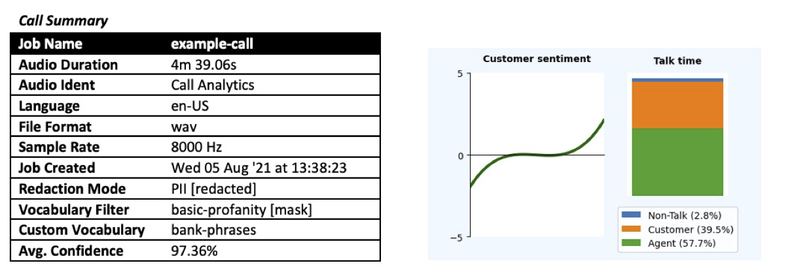
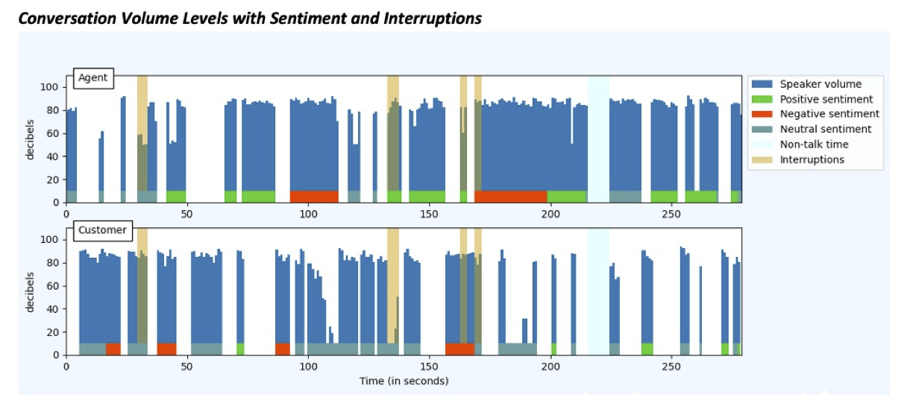
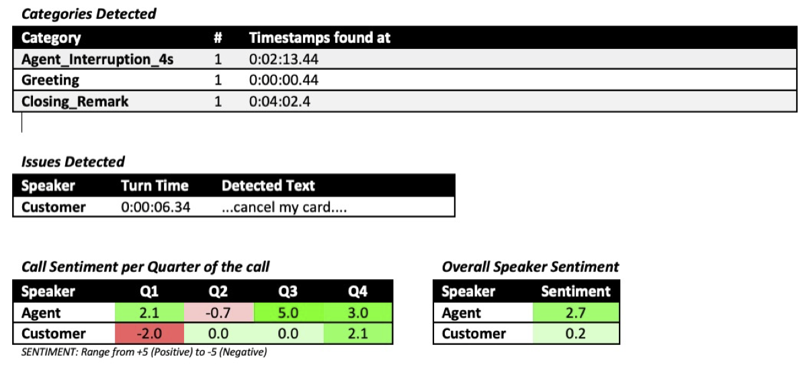
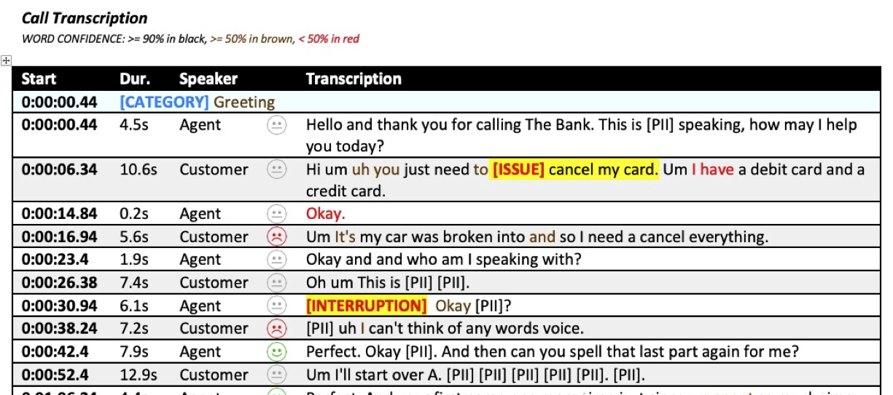
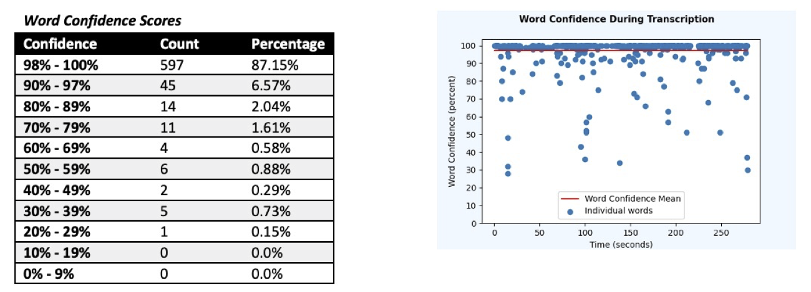
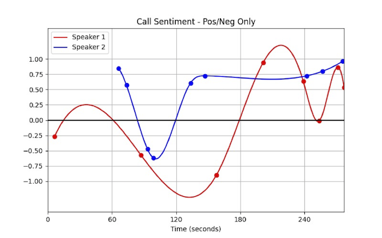

## Convert JSON To Word Document

#### Overview

This Python3 application will process the results of a synchronous Amazon Transcribe job and will turn it into a Microsoft Word document that contains a turn-by-turn transcript from each speaker.  It can handle processing a local JSON output file, or it can dynamically query the Amazon Transcribe service to download the JSON.  It works in one of two different modes:

- **Call Analytics Mode** - using the Call Analytics feature of Amazon Transcribe, the Word document will present all of the analytical data in either a tabular or graphical form
- **Standard Mode** - this will optionally call Amazon Comprehend to generate sentiment for each turn of the conversation.  This mode can handle either speaker-separated or channel-separated audio files

#### Features

The following table summarise which features are available in each mode.

| **Feature**                   | **Call Analytics Mode** | **Standard Mode**         |
| ----------------------------- | ----------------------- | ------------------------- |
| Job information [1]           | ☑️                       | ☑️                         |
| Word-level confidence scores  | ☑️                       | ☑️                         |
| Call-level sentiment          | ☑️                       |                           |
| Speaker sentiment trend [2]   | ☑️                       | ☑️ *via Amazon Comprehend* |
| Turn-level sentiment          | ☑️                       | ☑️ *via Amazon Comprehend* |
| Turn-level sentiment scores   |                         | ☑️ *via Amazon Comprehend* |
| Speaker volume                | ☑️                       |                           |
| Speaker interruptions         | ☑️                       |                           |
| Speaker talk time             | ☑️                       |                           |
| Call non-talk ("silent") time | ☑️                       |                           |
| Category detection [3]        | ☑️                       |                           |
| Call issue detection          | ☑️                       |                           |

*[1] If the JSON is read from a local file, but the underlying Amazon Transcribe job no longer exists, then the majority of the job information is no longer available*

*[2] Speaker sentiment trend in Call Analytics Mode only provides data points for each quarter of the call per speaker, whilst in Standard Mode it can provide points for each turn in the conversation*

*[3] Categories must first be defined by the customer within Amazon Transcribe, and only those defined when the Amazon Transcribe job executed will be reported*

#### Usage

##### Prerequisites

This application relies upon three external python libraries, which you will need to install onto the system that you wise to deploy this application to.  They are as follows:

- python-docx
- scipy
- matplotlib

These should all be installed using the relevant tool for your target platform - typically this would be via `pip`, the Python package manager, but could be via `yum`, `apt-get` or something else.  Please consult your platform's Python documentation for more information.

Additionally, as the Python code will call APIs in Amazon Transcribe and, optionally, Amazon Comprehend, the target platform will need to have access to AWS access keys or an IAM role that gives access to the following API calls:

- Amazon Transcribe - *GetTranscriptionJob()* and *GetCallAnalyticsJob()*
- Amazon Comprehend - *DetectSentiment()*

##### Parameters

The Python3 application has the following usage rules:

```
usage: ts-to-word (--inputFile filename | --inputJob job-id)
                  [--outputFile filename] [--sentiment {on,off}]
                  [--confidence {on,off}] [--keep]
```

- **Mandatory** - *(only one of these can be specified)*
  - `--inputFile` - path to a JSON results file from an Amazon Transcribe job that is to be processed
  - `--inputJob` - the JobId of the Amazon Transcribe job that is to be processed
- **Optional**
  - `--outputFile` - the name of the output Word document.  Defaults to the name of the input file/job with a ".docx" extention
  - `--sentiment {on|off}` - if this is a Standard Mode job then this will enable or disable the generation of sentiment data via Amazon Comprehend.  Defaults to off
  - `--confidence {on|off}` - displays a table and graph of confidence scores for all words in the transcript.  Defaults to off
  - `--keep` - retains any downloaded JSON results file

#### Sample Files

The repository contains the following sample files in the `sample-data` folder:

- **example-call.wav** - an example two-channel call audio file
- **example-call.json** - the result from Amazon Transcribe when the example audio file is processed in Call Analytics mode
- **example-call.docx** - the output document generated by this application against a completed Amazon Transcribe Call Analytics job using the example audio file.  The next section describes this file structure in more detail

## Microsoft Word Output



The header part of the transcript contains two sections – the call summary information, which is extracted from Transcribe’s APIs,  and if you have used Call Analytics then this is followed by the caller sentiment trend and talk time split on the call. As you can see, many of the custom options for Transcribe, such as PII redaction, custom vocabulary and vocabulary filters, are called out, so you can always see what options were used.

Note that if you processing a local JSON file, and the related Amazon Transcribe job is no longer available in your AWS acccount, then most of the details in the Call Summary will not be available, as they only exist in the status recorded associated with the job.



If you have used Call Analytics then this is followed by a graph combining many elements of the Call Analytics analysis.  This graph combines speaker decibel levels, sentiment per speech segment, non-talk time and interruptions.  If hen there is only one speaker on the call - unusual, but possible - then information is only shown for that speaker.



If you have used Call Analytics then this is followed some tables that show the following:

- Any user-defined categories that have been detected in the call (including timestamps)
- Any issues that have been detected in the call
- Speaker sentiment scores in the range +/- 5.0 for each quarter of the call and for the whole call



In the transcribe we show the obvious things – the speech segment text, the start time for that segment and its duration. We also show the sentiment indicator for that segment if it has been enabled or if it was a Call Analytics job.  Naturally, as is common in call centre scenarios, line-by-line sentiment is often neutral, which is partly why we have now added the per-quarter and whole-call sentiment values to Call Analytics.  If this is not a Call Analytics job then the sentiment indicator will also include the sentiment scrore, as provided by Amazon Comprehend.

If this is a Call Analytics job then we also indicate where we have detected categories, issues and interruptions, highlighting the point of the call where it happened and also emphasing the text that triggered the issue detection.



If you have enabled it then we show the word confidence scores for this audio file transcript. We show how the confidence scores are distributed across a number of buckets. The scatter plot and confidence mean is also shown, and in this example our average confidence score was 97.36%.

If sentiment has been enabled on a non-Call Analytics jobt then we will display this call sentiment graph.  This shows the sentiment per speaker where the speech segment was not neutral, which implies that there my be far fewer datapoints per speaker than they have speech segments attributed to them.



## Security	

See [CONTRIBUTING](CONTRIBUTING.md#security-issue-notifications) for more information.

## License

This library is licensed under the MIT-0 License. See the LICENSE file.

